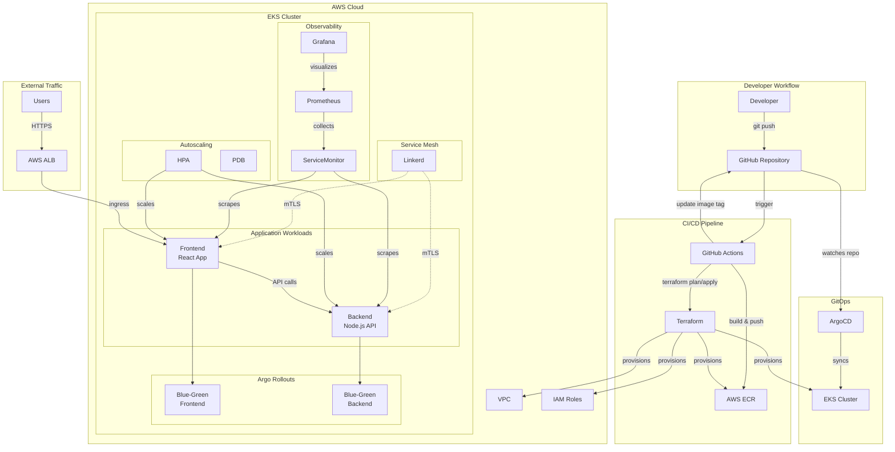
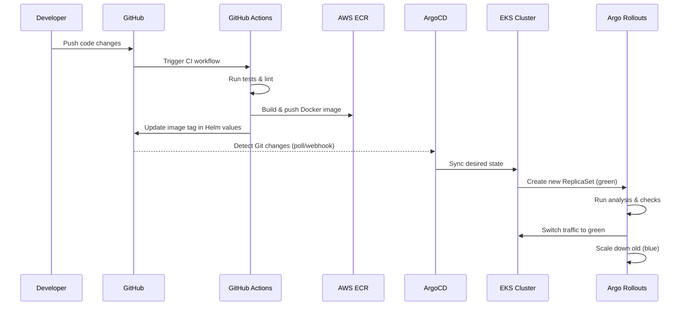
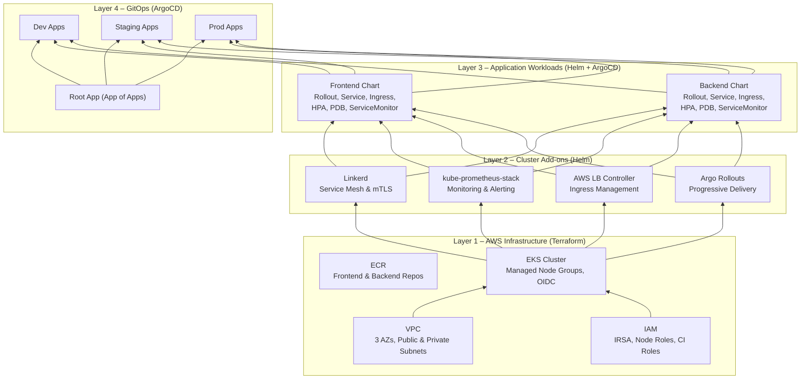
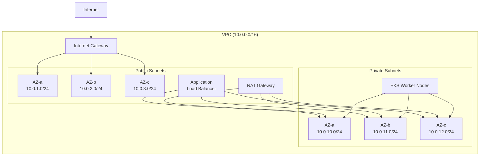
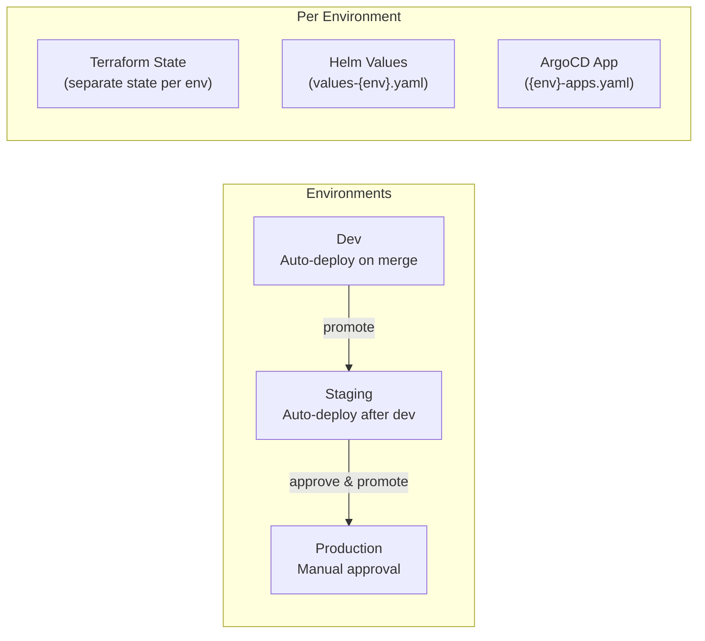

# EKS Blueprint Architecture

## High-Level Architecture

```mermaid
graph TB
    subgraph "Developer Workflow"
        DEV[Developer] -->|git push| GH[GitHub Repository]
    end

    subgraph "CI/CD Pipeline"
        GH -->|trigger| GHA[GitHub Actions]
        GHA -->|build & push| ECR[AWS ECR]
        GHA -->|update image tag| GH
        GHA -->|terraform plan/apply| TF[Terraform]
    end

    subgraph "GitOps"
        GH -->|watches repo| ARGOCD[ArgoCD]
        ARGOCD -->|syncs| EKS
    end

    subgraph "AWS Cloud"
        TF -->|provisions| VPC[VPC]
        TF -->|provisions| EKS[EKS Cluster]
        TF -->|provisions| ECR
        TF -->|provisions| IAM[IAM Roles]

        subgraph "EKS Cluster"
            subgraph "Application Workloads"
                FE[Frontend<br/>React App]
                BE[Backend<br/>Node.js API]
            end

            subgraph "Argo Rollouts"
                BG_FE[Blue-Green<br/>Frontend]
                BG_BE[Blue-Green<br/>Backend]
            end

            subgraph "Service Mesh"
                LINKERD[Linkerd]
            end

            subgraph "Observability"
                PROM[Prometheus]
                GRAF[Grafana]
                SM[ServiceMonitor]
            end

            subgraph "Autoscaling"
                HPA[HPA]
                PDB[PDB]
            end

            FE --> BG_FE
            BE --> BG_BE
            LINKERD -.->|mTLS| FE
            LINKERD -.->|mTLS| BE
            SM -->|scrapes| FE
            SM -->|scrapes| BE
            PROM -->|collects| SM
            GRAF -->|visualizes| PROM
            HPA -->|scales| FE
            HPA -->|scales| BE
        end
    end

    subgraph "External Traffic"
        USER[Users] -->|HTTPS| ALB[AWS ALB]
        ALB -->|ingress| FE
        FE -->|API calls| BE
    end
```

## Deployment Flow

```mermaid
sequenceDiagram
    participant Dev as Developer
    participant GH as GitHub
    participant GHA as GitHub Actions
    participant ECR as AWS ECR
    participant Argo as ArgoCD
    participant EKS as EKS Cluster
    participant Rollout as Argo Rollouts

    Dev->>GH: Push code changes
    GH->>GHA: Trigger CI workflow
    GHA->>GHA: Run tests & lint
    GHA->>ECR: Build & push Docker image
    GHA->>GH: Update image tag in Helm values
    GH-->>Argo: Detect Git changes (poll/webhook)
    Argo->>EKS: Sync desired state
    EKS->>Rollout: Create new ReplicaSet (green)
    Rollout->>Rollout: Run analysis & checks
    Rollout->>EKS: Switch traffic to green
    Rollout->>Rollout: Scale down old (blue)
```

## Infrastructure Layers

```mermaid
graph BT
    subgraph "Layer 1 – AWS Infrastructure (Terraform)"
        VPC["VPC<br/>3 AZs, Public & Private Subnets"]
        IAM["IAM<br/>IRSA, Node Roles, CI Roles"]
        ECR_L["ECR<br/>Frontend & Backend Repos"]
        EKS_L["EKS Cluster<br/>Managed Node Groups, OIDC"]
    end

    subgraph "Layer 2 – Cluster Add-ons (Helm)"
        LINKERD_L["Linkerd<br/>Service Mesh & mTLS"]
        PROM_L["kube-prometheus-stack<br/>Monitoring & Alerting"]
        ALB_L["AWS LB Controller<br/>Ingress Management"]
        ROLLOUTS_L["Argo Rollouts<br/>Progressive Delivery"]
    end

    subgraph "Layer 3 – Application Workloads (Helm + ArgoCD)"
        FE_L["Frontend Chart<br/>Rollout, Service, Ingress,<br/>HPA, PDB, ServiceMonitor"]
        BE_L["Backend Chart<br/>Rollout, Service, Ingress,<br/>HPA, PDB, ServiceMonitor"]
    end

    subgraph "Layer 4 – GitOps (ArgoCD)"
        ROOT["Root App (App of Apps)"]
        DEV_APP["Dev Apps"]
        STG_APP["Staging Apps"]
        PRD_APP["Prod Apps"]
        ROOT --> DEV_APP
        ROOT --> STG_APP
        ROOT --> PRD_APP
    end

    VPC --> EKS_L
    IAM --> EKS_L
    EKS_L --> LINKERD_L
    EKS_L --> PROM_L
    EKS_L --> ALB_L
    EKS_L --> ROLLOUTS_L
    LINKERD_L --> FE_L
    LINKERD_L --> BE_L
    PROM_L --> FE_L
    PROM_L --> BE_L
    ALB_L --> FE_L
    ALB_L --> BE_L
    ROLLOUTS_L --> FE_L
    ROLLOUTS_L --> BE_L
    FE_L --> DEV_APP
    BE_L --> DEV_APP
    FE_L --> STG_APP
    BE_L --> STG_APP
    FE_L --> PRD_APP
    BE_L --> PRD_APP
```

## Network Architecture

```mermaid
graph TB
    subgraph "VPC (10.0.0.0/16)"
        subgraph "Public Subnets"
            PUB_A["AZ-a<br/>10.0.1.0/24"]
            PUB_B["AZ-b<br/>10.0.2.0/24"]
            PUB_C["AZ-c<br/>10.0.3.0/24"]
            ALB_N["Application<br/>Load Balancer"]
            NAT["NAT Gateway"]
        end

        subgraph "Private Subnets"
            PRV_A["AZ-a<br/>10.0.10.0/24"]
            PRV_B["AZ-b<br/>10.0.11.0/24"]
            PRV_C["AZ-c<br/>10.0.12.0/24"]
            NODES["EKS Worker Nodes"]
        end

        IGW["Internet Gateway"] --> PUB_A
        IGW --> PUB_B
        IGW --> PUB_C
        ALB_N --> PRV_A
        ALB_N --> PRV_B
        ALB_N --> PRV_C
        NAT --> PRV_A
        NAT --> PRV_B
        NAT --> PRV_C
        NODES --> PRV_A
        NODES --> PRV_B
        NODES --> PRV_C
    end

    INTERNET[Internet] --> IGW
```

## Environment Promotion

```mermaid
graph LR
    subgraph "Environments"
        DEV_E["Dev<br/>Auto-deploy on merge"]
        STG_E["Staging<br/>Auto-deploy after dev"]
        PRD_E["Production<br/>Manual approval"]
    end

    DEV_E -->|promote| STG_E
    STG_E -->|approve & promote| PRD_E

    subgraph "Per Environment"
        TF_ENV["Terraform State<br/>(separate state per env)"]
        HELM_ENV["Helm Values<br/>(values-{env}.yaml)"]
        ARGO_ENV["ArgoCD App<br/>({env}-apps.yaml)"]
    end
```
